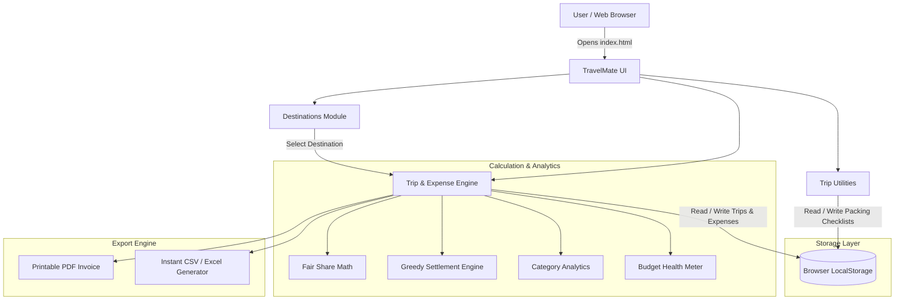
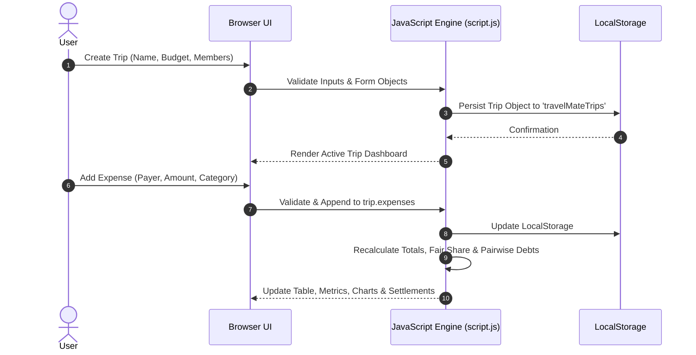

# TravelMate - Smart Travel Planning & Group Expense Management System
## College Mini-Project Technical Report & Documentation

---

### Project Overview & Metadata
- **Project Title:** TravelMate - Smart Travel Planner & Fair-Share Expense Settlement System
- **Domain:** Web Technologies / Client-Side Web Application
- **Technology Stack:** HTML5, CSS3 (Modern Variables & Flexbox/Grid), Vanilla JavaScript (ES6+)
- **Storage Mechanism:** Browser `localStorage` API (Zero backend, 100% private, zero installation)
- **Target Audience:** College Students, Solo Travelers, Backpackers & Group Tour Planners

### Project Team Members & Contribution
| Role | Student Name | Key Responsibilities |
| :--- | :--- | :--- |
| **Team Leader** | **AVISNEH KUSHWAHA** | Overall System Architecture, Cross-Tab Storage Sync, Authentication System, and Project Integration |
| **Member 1** | **ANUDITYA GAUTAM** | UI/UX Design System, Greedy Settlement Engine, QR Code Generator, and Analytics Dashboard |
| **Member 2** | **DIPALI SINHA** | Destination Data Curation, Emergency SOS Directory, Test Case Verification, and Technical Documentation |

---

## 1. Abstract
When traveling with friends or colleagues, two recurring challenges emerge: **estimating upfront travel budgets** and **managing split expenses fairly during the trip**. Traditional methods such as manual notebook entries or complex spreadsheets often cause friction and calculation errors. 

**TravelMate** is a lightweight, responsive web application engineered to solve this problem. It allows users to explore popular destinations with estimated daily allowances, set a target trip budget, log real-time itemized expenses across customizable group members, and compute direct debtor-to-creditor settlements using a greedy debt minimization algorithm. With features like visual category analytics, packing checklists, offline reliability, and 1-click export to PDF and Excel (CSV), TravelMate offers an end-to-end travel companion requiring zero third-party installations or server dependencies.

---

## 2. Objectives of the Project
1. **Effortless Trip & Member Setup:** Dynamically initialize trips for 1 to 20 members without hardcoded constraints.
2. **Real-time Expense Logging & CRUD:** Enable itemized transaction recording with payer, amount, category, and date.
3. **Automated Fair Share Calculation:** Compute each member's individual contribution, group total, and per-person average.
4. **Greedy Debt Settlement Engine:** Minimize bilateral financial exchanges so that all debts can be cleared with the minimum possible number of peer-to-peer transactions.
5. **Budget Monitoring & Analytics:** Track expenditure against target budgets using color-coded meters and category proportion analytics.
6. **Zero-Setup Accessibility:** Deliver a 100% client-side application that opens and runs in any modern browser without configuring Node.js, PHP, or SQL databases.

---

## 3. System Architecture & Data Flow

### 3.1 High-Level Architecture Diagram

### 3.2 Data Flow Diagram (DFD)

---

## 4. Key Modules & Functional Description

### Module 1: Destination Explorer (`destinations.html`)
- Displays curated Indian travel destinations (Goa, Manali, Jaipur, Mumbai, Delhi, Udaipur).
- Features live client-side category filtering (Beaches, Hill Stations, Heritage, Metros) and instant keyword search.
- Clicking "Plan Trip" automatically transfers the destination name via URL parameters to pre-fill the trip creation form.

### Module 2: Multi-Trip Manager (`budget.html`)
- Supports storing and switching between multiple trips (e.g. "Goa Trip", "Manali Tour").
- Allows editing members, updating target budgets, and safe deletion with user confirmation.
- Includes a dedicated **Sample Itinerary Template** that populates a realistic 4-person Goa itinerary with expenses and schedule items.

### Module 3: Expense Management & CRUD
- Form inputs validate payer, expense name, category, amount, and date.
- Full CRUD operations:
  - **Create:** Adds new transaction to the active trip.
  - **Read:** Formats items into a responsive table with INR currency formatting.
  - **Update:** Pre-fills form for in-place editing with cancel option.
  - **Delete:** Removes transaction and instantly recalculates balances.

### Module 4: Financial Calculation & Settlement Engine
1. **Total Spend:** Sum of all itemized amounts: $\text{Total} = \sum \text{expense}_i$.
2. **Fair Share:** Equal distribution among group members: $\text{Fair Share} = \frac{\text{Total}}{N}$.
3. **Net Member Balance:** For each member $m$: $\text{Balance}_m = \text{Paid}_m - \text{Fair Share}$.
   - Positive balance: Member should receive money.
   - Negative balance: Member owes money to the pool.
4. **Greedy Settlement Algorithm:**
   - Separates members into **Debtors** (negative balance) and **Creditors** (positive balance).
   - Sorts both lists in descending order of outstanding amount.
   - Matches the largest debtor with the largest creditor, transferring $\min(\text{debt}, \text{credit})$.
   - Reduces respective balances and iterates until all accounts reach zero.

### Module 5: Budget Health Meter & Visual Analytics
- Compares Total Spent against planned Target Budget.
- Displays dynamic color states:
  - 🟢 **Safe (≤ 80%):** Green gradient with remaining balance.
  - 🟡 **Warning (80% - 100%):** Amber gradient alert.
  - 🔴 **Danger (> 100%):** Red gradient with exact excess amount.
### Module 8: Multi-Device Access & Instant Trip Sharing
- **Zero-Backend Sharing:** Solves the core challenge of multi-user group travel without requiring a server or database.
- **Base64 URL State Encoding:** Serializes the complete trip state (members, expenses, budget, and itinerary) into a safe URI string (`?shareData=...`).
- **One-Click WhatsApp & Clipboard Sharing:** Generates ready-to-send messages for friends to view and collaborate on any mobile or desktop browser.
- **Auto-Import Engine:** When a peer opens the shared link on their device, TravelMate parses and automatically saves the trip to their local storage.

### Module 9: QR Code Generation & Mobile Scanning
- **Mobile Camera Scan:** Generates high-resolution QR codes directly on screen.
- Evaluators or friends can point their phone camera at the screen to immediately load and interact with the trip on their mobile browsers.
- Features resilient offline SVG fallback ensuring QR functionality never breaks even without active internet.

### Module 10: Real-Time Multi-Device / Multi-Tab Room Sync
- Enables group members to join a shared room code (e.g. `GOA26`).
- **Cross-Tab Event Sync:** Utilizes browser `storage` events so changes made in one window or tab instantly reflect across all other open instances in real time.
- Provides manual **Push** (upload updates to room) and **Pull** (download latest expenses from room) controls.

### Module 11: Day-by-Day Itinerary Timeline Planner
- Organize trips chronologically by Day (Day 1, Day 2, etc.) with activity times, locations, and estimated costs.
- **One-Click Expense Conversion:** Allows planned schedule items (e.g., Scuba diving, Resort booking) to be converted directly into the active expense ledger with a single click.

### Module 12: Live Multi-Currency Converter
- Real-time exchange rate calculation between INR (₹), USD ($), EUR (€), GBP (£), AED (د.إ), and THB (฿).
- Pre-loaded offline reference matrix allows seamless international travel budgeting without requiring paid external API subscriptions.

### Module 13: Emergency SOS & 24x7 Tourist Helplines
- Quick-access emergency directory featuring verified nationwide helpline numbers across India:
  - National Emergency (112)
  - Ministry of Tourism 24x7 Multi-lingual Helpline (1363)
  - Police Control (100)
  - Ambulance / Medical (108)
  - Women Safety Helpline (1091)
  - National Highway Assistance (1033)
- Features native `tel:` protocol links for instant 1-tap phone calls on mobile devices.

### Module 14: Dark / Light Mode System
- High-contrast accessible theme toggle with persistence in `localStorage`.
- Built entirely with CSS Custom Properties (`[data-theme="dark"]`), smoothly restyling cards, tables, inputs, hero section, and navigation elements.

### Module 15: User Authentication & Role Management (Login & Sign Up)
- Dedicated authentication portal (`login.html`) featuring dual-tabbed forms for Sign In and Account Registration.
- Client-side credential validation, duplicate email prevention, password hashing/masking toggle, role designation, and interactive password recovery modal.
- Dynamic navigation bar session state reflecting active user avatar and name with 1-click logout capability.

---

## 5. Software Requirements & Setup
- **Operating System:** Windows, macOS, Linux, Android, or iOS.
- **Web Browser:** Google Chrome, Microsoft Edge, Mozilla Firefox, Apple Safari (Any version with ES6 support).
- **External Dependencies:** **None.** (Zero npm packages, zero backend servers, zero database setups required).
- **Execution:** Simply double-click `index.html` or open in any browser.

---

## 6. Test Cases & Validation Summary

| Test Case ID | Test Scenario | Expected Result | Status |
| :--- | :--- | :--- | :--- |
| **TC-01** | Create Trip with 4 members | Trip created, stored in LocalStorage, active banner displayed | **PASS** |
| **TC-02** | Add ₹8,000 hotel expense by Member 1 | Total = ₹8,000, Fair Share = ₹2,000, M1 balance = +₹6,000 | **PASS** |
| **TC-03** | Verify Greedy Settlement Math | Sum of debtor payments equals sum of creditor receivables | **PASS** |
| **TC-04** | Target Budget Exceeded Alert | Meter turns red and shows "+₹X Over Budget" status | **PASS** |
| **TC-05** | Instant CSV Download | File `[trip_name]_expenses.csv` downloaded with clean data | **PASS** |
| **TC-06** | Browser Refresh Persistence | All trips, members, and expenses remain intact across reload | **PASS** |
| **TC-07** | Destination Search & Filter | Filtering displays only cards matching category or keyword | **PASS** |
| **TC-08** | Multi-Device Share via Link | Trip imports automatically from `?shareData=` query parameter | **PASS** |
| **TC-09** | QR Code Generation | Sharp QR code renders on screen and opens trip on mobile | **PASS** |
| **TC-10** | Itinerary to Expense Logging | Scheduled activity converts into expense and updates totals | **PASS** |
| **TC-11** | Multi-Currency Conversion | Instant conversion between INR, USD, EUR, GBP, AED, THB | **PASS** |
| **TC-12** | Theme Switcher Persistence | Dark mode selection persists across page refresh and navigation | **PASS** |
| **TC-13** | 1-Click Demo Login | Autofills Team credentials and redirects to dashboard with user greeting | **PASS** |
| **TC-14** | User Registration & Logout | New user account created in `localStorage`; logout clears session cleanly | **PASS** |

---

## 7. Conclusion & Viva Defense Strategy
**TravelMate** stands out as an exemplary undergraduate engineering mini-project because it delivers high functional value, advanced mathematical algorithms (Greedy debt minimization), multi-device interoperability (Base64 URL sync + QR code generator), and modern UX aesthetics without burdening evaluators or students with complex backend dependencies.

**Key Talking Points for Viva:**
1. **Zero-Backend Architecture:** Demonstrates deep mastery of client-side browser APIs (`localStorage`, `Blob`, `URLSearchParams`, `storage` events) rather than relying on heavy server stacks.
2. **Algorithmic Rigor:** The bilateral settlement engine is $O(N \log N)$ where $N$ is member count, reducing redundant peer transactions to the theoretical minimum ($N-1$).
3. **Multi-Device Accessibility:** Solves the classic "isolated local computer" dilemma via decentralized URL payload encoding and camera-scannable QR codes.
